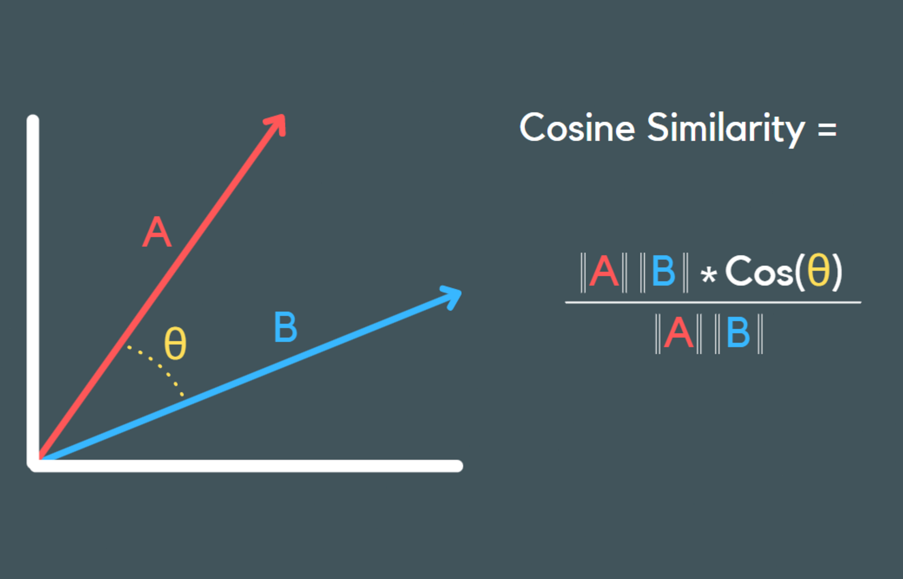

Here is the explanation **with clear pictures**, but **no emojis**.

---

# 1. What is a sentence embedding?

A sentence embedding is a **vector** (a list of numbers) that represents the meaning of a sentence.

The sentence is converted into a numerical vector so the computer can understand and compare meaning.

---

# 2. Why do we use sentence embeddings?

Because computers cannot understand text directly.
They understand **vectors**.

Embeddings allow:

* Comparing meaning
* Semantic search (search by meaning)
* Finding duplicate sentences
* RAG / Chatbots
* Classification and clustering

---

# 3. What is cosine similarity?

Cosine similarity measures how close two vectors are by comparing the **angle** between them.

Interpretation:

* 1.0 → same meaning
* 0.5–0.9 → similar meaning
* 0 → no relation
* -1 → opposite (rare in NLP)

---

# 4. Example

Two sentences:

1. "I love playing football."
2. "I enjoy playing soccer."

The embeddings will be close.
Cosine similarity → for example **0.89**

This shows they have similar meaning even if the words are different.

---

# 5. Why not Euclidean distance?

Cosine similarity focuses on **direction only**, not vector length, so it is better for:

* high-dimensional vectors
* semantic meaning
* normalized embeddings

---

# 6. Summary

* A sentence embedding is a vector representing meaning.
* Cosine similarity compares these vectors.
* Together, they allow machines to measure meaning between sentences.
